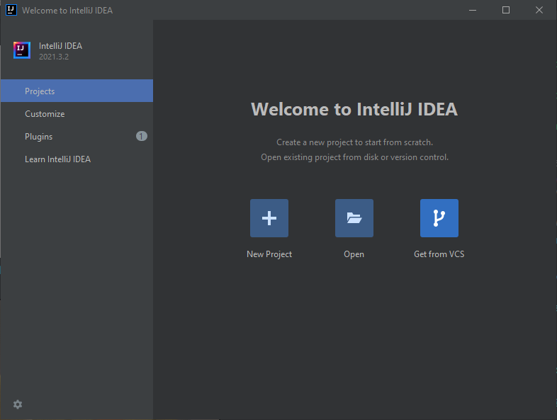

# Introduction to CAB302

This exercise is to familiarise you with cloning projects from a remote Git repository so that you can work on them in IntelliJ IDEA on your own machine. Most CAB302 practicals will work this way - the first step you will take is cloning a Git repository.

First, you need to run IntelliJ and get ready to clone from a remote version control system. There are two main ways you might do this. Note that these instructions are for Windows, but everything should be fairly similar in Linux and Mac OS (Git will not have the filename `git.exe`, of course).

### From the IntelliJ IDEA launcher

When you launch IDEA, if you had a project open when you last used it, that project will re-open automatically. However, if this is your first time launching IDEA or you closed the current project, you will be greeted by the IntelliJ IDEA launcher, which will look something like this:

From here, you can click 'Get from VCS' to clone a project from a remote repository. If you try this and you get a message saying that Git is not installed, then you need to install Git first. If you've installed Git and it still gives you this message, you will need to tell it where Git is. From the launcher, click 'Customize', then click 'All settings...'. There is a search box in the top left corner - click on this and type in 'Git'. Then you should be able to easily find Version Control -> Git in the settings tree below the search box. On that screen, you will want to click the folder icon inside the 'Path to Git executable:' text field, then navigate to where you installed Git and find the git.exe file inside there (it's usually in a directory called 'bin' inside the Git directory.) Then click 'Test' - if it shows Git's version number, the test was successful and you can now click 'OK' at the bottom of the dialog.

### From inside an IntelliJ IDEA project

If you already created a project in IntelliJ, you will instead need to clone the project by going to File -> New -> Project from Version Control. This will open up the same dialog as before. If Git is not installed properly, go to File -> Settings, then follow the instructions from the previous section to tell it where your Git executable is.

# Cloning the project

Once you have clicked 'Project from Version Control' / 'Get from VCS' and have Git installed and working, you should be looking at a prompt with a text field titled 'URL:' and a file browser field titled 'Directory:'. You will need to get the project's URL from GitHub and put it in the URL field.

From the GitHub page of the project, click on the green 'Code' button. This will open up a small window. First, make sure 'HTTPS' is selected, then copy the URL. Paste the URL into IDEA and click 'Clone'. You can also change the directory if you would prefer to keep your projects in another location.
